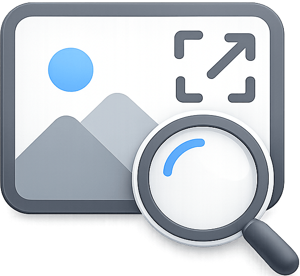

  

<h1 align="center">Image Zoom+</h1>

  <strong>Instantly preview full-resolution images & videos on hover.</strong> 
  A modern, lightweight, and privacy-focused hover zoom extension built entirely on <b>Chrome's Manifest V3</b>.

  
  
  
  
  

---

## 🌟 Overview

**Image Zoom+** is a high-performance browser extension that displays high-resolution overlays of images and videos when you hover your cursor over thumbnails, links, or media grids. 

If you are looking for a weightless, modern, and privacy-focused alternative to legacy extensions like *Hover Zoom* or *Imagus*, Image Zoom+ offers clean execution, local scripts, zero remote tracking, and smooth web performance.

---

## 🚀 Key Features

*   **🔍 Instant Hover Previews:** Hover over any thumbnail or media link (on Reddit, Twitter, Wikipedia, Amazon, etc.) to view the original full-size media immediately in an overlay.
*   **🖱️ Scroll to Zoom:** Dynamically zoom in and out (from `0.5x` up to `10x`) using your mouse scroll wheel while hovering over the preview.
*   **📐 Drag to Resize & Aspect Ratio Lock:** Click and drag any corner or border of the preview window to resize it. The window automatically locks and preserves the correct media aspect ratio.
*   **📌 Drag & Pin (Positioning):** Press **P** or click the Pin button on the overlay to lock it in place. Drag it anywhere on the screen via its top bar.
*   **✋ Drag to Pan:** Easily click and drag inside the preview overlay to navigate and inspect extra-large images.
*   **📊 Real-time Stats Counter:** Keep track of your usage! View total previews zoomed today and all-time directly from the extension settings popup.
*   **⏱️ Preload Countdown Visuals:** Custom hover delays display a non-intrusive countdown toast (*"Opening in X.Xs"*), preventing accidental triggers when scrolling grids.
*   **📊 Metadata HUD Bar:** View file details instantly, including exact dimensions, file type, file size, and the host domain.
*   **🖼️ Smart Upscaling:** Automatically scales up tiny low-res assets (under 400x300px) with crisp CSS rules, avoiding pixelation.

---

## ⚡ Smart Source Pipeline

Image Zoom+ doesn't just stretch thumbnails. It resolves the highest quality version of an image in the background:
- **CDN Parameter Stripping:** Automatically removes transformation and cropping parameters from Google CDN, Amazon, and other major hosts.
- **Srcset Parsing:** Evaluates complex responsive picture and source attributes.
- **Lazy Load Detection:** Dynamically extracts source URLs from hidden data attributes.

---

## ⌨️ Action Bar & Hotkeys

While hovering over a preview, perform quick actions using these key combinations:

| Hotkey | Action | Description |
| :---: | :--- | :--- |
| **`X`** *(Hold)* | **Temp Mute** | Temporarily disable previews while moving your cursor across dense grids. |
| **`P`** | **Pin / Unpin** | Lock the preview window in place to move it or interact with it. |
| **`C`** | **Copy URL** | Copy the direct link of the full-resolution image to your clipboard. |
| **`O`** | **Open in New Tab** | Open the full-resolution asset in a new browser tab. |
| **`D`** | **Download** | Instantly download the image/video to your default downloads folder. |
| **`S`** | **Search** | Trigger a Google Lens reverse image search for the image. |

---

## 🛠️ Local Installation & Development

Since this extension runs entirely locally, you can easily load it into your Chrome-based browser:

1. **Clone this repository** (or download the source code).
2. Open Google Chrome and navigate to `chrome://extensions/`.
3. Enable **Developer mode** (toggle in the top-right corner).
4. Click **Load unpacked** in the top-left corner.
5. Select the project folder containing `manifest.json`.

---

## 🔒 100% Private & Open Source

- **No Remote Servers:** All media fetching and analysis happen directly on your machine.
- **No Analytics/Tracking:** Your statistics are stored entirely locally in Chrome's local storage and are never uploaded.
- **No Account Required:** Simply install and start browsing.

---

## 📄 License

This project is licensed under the [MIT License](LICENSE).
